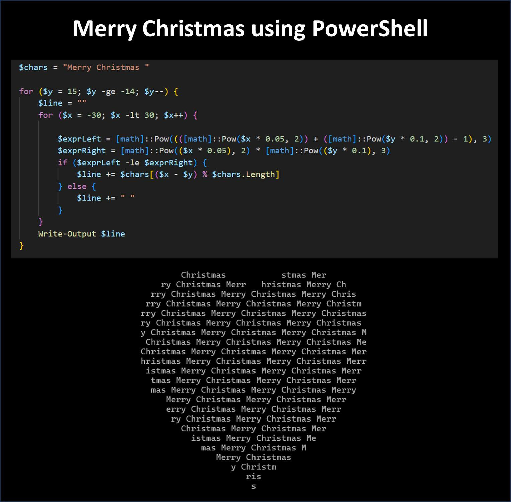

  
  

# Doug Finke's PowerShell Scripts Collection

Welcome to  Doug Finke's PowerShell Scripts Collection! This repository is a curated selection of PowerShell scripts that I have developed over time.

Please ⭐ the repo and share it with others if you find it useful.
Click the 👁️ watch to get updates when new scripts are added.
Both are in the upper right.

The scripts are designed for various purposes, including automation, data processing, and fun coding projects. Whether you're looking for practical solutions to common tasks or just want to explore different scripting techniques, you'll find a diverse range of examples here.

I encourage you to dive in, try them out, and adapt them to your own needs!

## Holidays

[Merry-Christmas](code/Holidays/Merry-Christmas.ps1)

